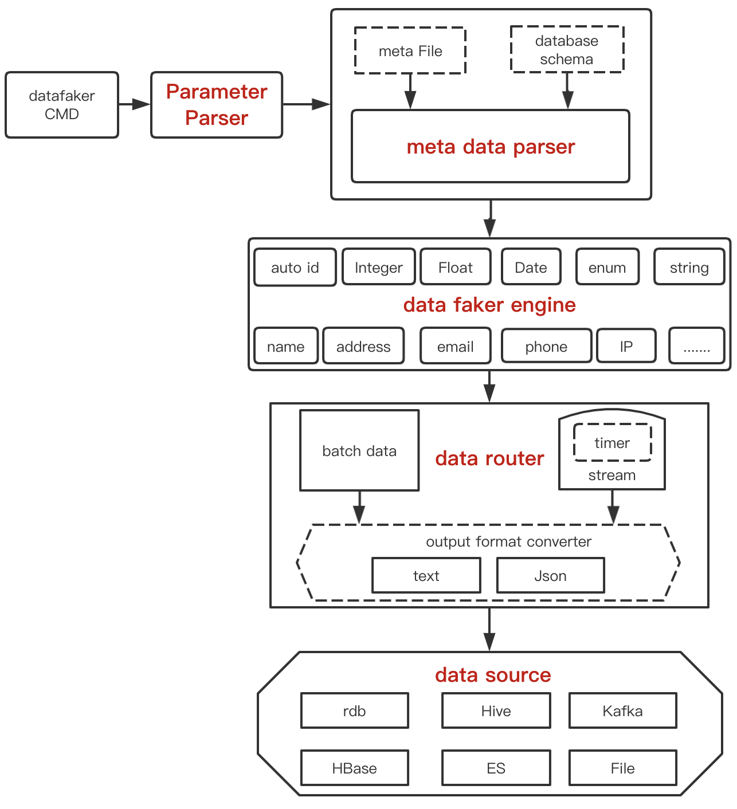

Datafaker - Tool for faking data
=========

[](https://www.apache.org/licenses/LICENSE-2.0.html)

[](https://starchart.cc/gangly/datafaker)
   
English | [中文](doc/zh_CN/README.md)


## 1. Introduction

Datafaker is a large-scale test data and flow test data generation tool. It is compatible with python2.7 and python3.4+. Welcome to download and use. The github address is:

https://github.com/gangly/datafaker

Document sync updates on github

## 2. Background
In the software development testing process, test data is often needed. These scenarios include:

- Backend development
After creating a new table, you need to construct database test data and generate interface data for use by the front end.
- Database performance test
generates a lot of test data to test database performance
- Stream data test
For kafka streaming data, it is necessary to continuously generate test data to write to kafka.

After research, there is currently no open source test data generation tool for generating data with similar structure in mysql table. The common method is to manually create several pieces of data into the database. The disadvantage of this method is

- Wasting work hours
needs to construct different data for fields of different data types of the table
- Small amount of data
If you need to construct a lot of data, you can't do it manually.
- Not accurate enough
For example, you need to construct a mailbox (satisfying a certain format), a phone number (determined number of digits), an ip address (fixed format), age (cannot be negative, have a size range), and so on. These test data have certain restrictions or rules, and the manual construction may not meet the data range or some format requirements, resulting in the backend program error.
- Multi-table association
The amount of data created manually is small, and the primary key in multiple tables may not be associated with, or associated with no data.
- Dynamic random write
For example, for streaming data, you need to write kafka randomly every few seconds. Or dynamically insert mysql randomly, manual operation is relatively cumbersome, and it is not good to count the number of data written.

In response to these current pain points, datafaker came into being. Datafaker is a multi-data source test data construction tool that can simulate most common data types and easily solve the above pain points. Datafaker has the following features:

- Multiple data types.
includes common database field types (integer, float, character), custom types (IP address, mailbox, ID number, etc.)
- Simulate multi-table association data
By formulating some fields as enumerated types (randomly selected from the specified data list), in the case of a large amount of data, it can ensure that multiple tables can be associated with each other and query data.
- Support batch data and stream data generation, and specify stream data interval time
- Support multiple data output methods, including screen printing, files and remote data sources
- Support for multiple data sources. Currently supports relational databases, Hive, Kafka. Will be extended to Mongo, ES and other data sources.
- Can specify the output format, currently supports text, json

## 3. Architecture
Datafaker is written in python and supports python2.7, python3.4+. The current version has been released on pypi.


<!-- <div align=center>
<!-- src="https://github.com/gangly/datafaker/blob/master/doc/img/datafaker.png" width="500" height="600" alt="软件架构"/> -->
<!-- </div> -->



The architecture diagram completely shows the execution process of the tool. From the figure, the tool has gone through five modules:

- Parameter parser. Parse the commands that the user enters from the terminal command line.
- Metadata parser. Users can specify metadata from local files or remote database tables. After the parser obtains the content of the file, the text content is parsed into table field metadata and data construction rules according to the rules.
- Data construction engine. The construction engine constructs rules based on the data generated by the metadata parser, simulating the generation of different types of data.
- Data routing. According to different data output types, it is divided into batch data and stream data generation. Stream data can specify the frequency of generation. The data is then converted to a user-specified format for output to a different data source.
- Data source adapter. Adapt to different data sources and import the data into the data source.

## 4. Installation

#### Method 1, install from source code:
Download the source file, unzip and install:
```bash
python setup.py install
 ```

#### Method 2, use pip:
```bash
pip install datafaker
```

#### Upgrade tool
```bash
pip install datafaker --upgrade
```

#### Uninstall tool
```bash
pip uninstall datafaker
```

#### Install require package
| data source | package | note |
| -------- | -------- | ------ |
|mysql/tidb| mysql-python/mysqlclient | windows+python3 use mysqlclient|
|oracle| cx-Oracle | need some oracle lib |
|postgresql/redshift | psycopg2 |  |
|Hbase | happybase,thrift | |
|es | elasticsearch | |
|hive | pyhive | |
|kafka | kafka-python | |

## 5. examples

[usage example(使用举例)](doc/UseExample.md)


## 6. command parameters

[parameters detail(命令行参数)](doc/cmdParameters.md)


## 7. construction rule

[construction rule(构造规则)](doc/ConstructionRule.md)

## 8. note

[note(注意事项)](doc/note.md)

## 9. Release note
[Release note(发布记录)](doc/release_note.md)
_____

**Give a star or donate a coffee to the author**
- 给作者点个star或请作者喝杯咖啡


